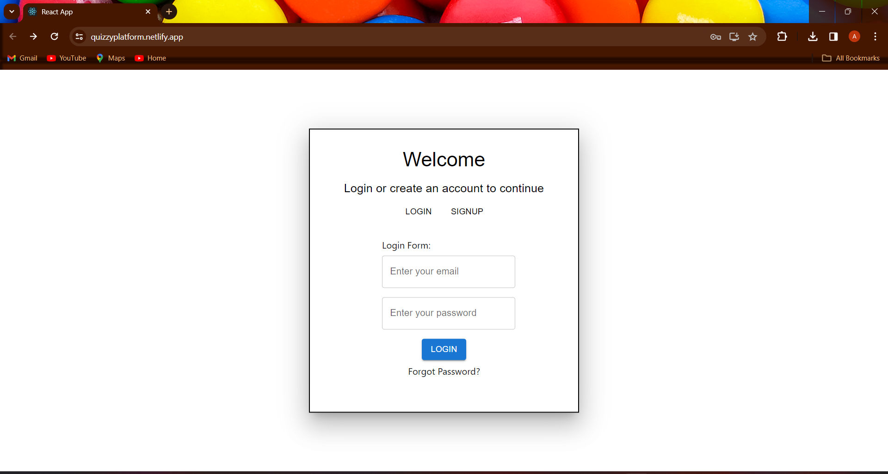
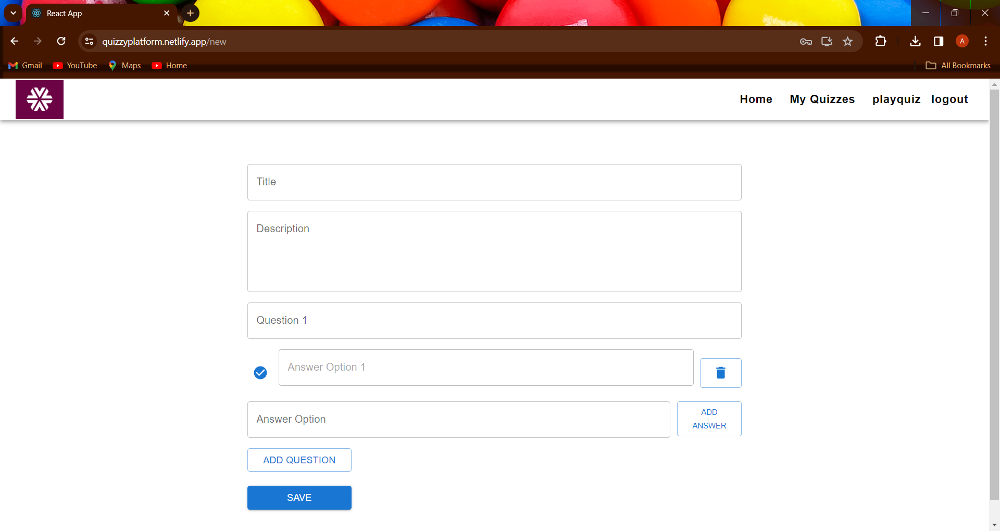
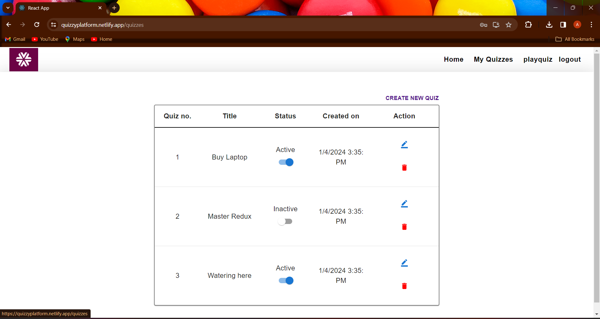
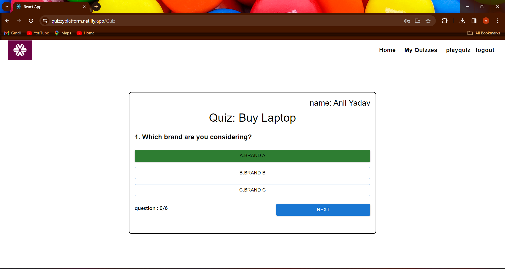
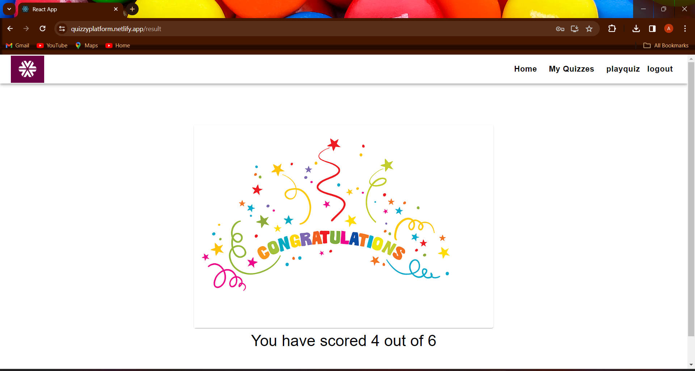

# Quiz Platform

The Quiz platform project aims to develop a web application enabling users to take quizzes, create their own, and manage quiz data. It comprises frontend UI components, logic for quiz management, user authentication, and Redux for state management.

## Deployment

Deployed link:
click here : https://quizzyplatform.netlify.app/

## Tech Stack

React JS,React Router ,Redux ,Redux Thunk ,Material-UI ,Firebase.

## Screenshots

